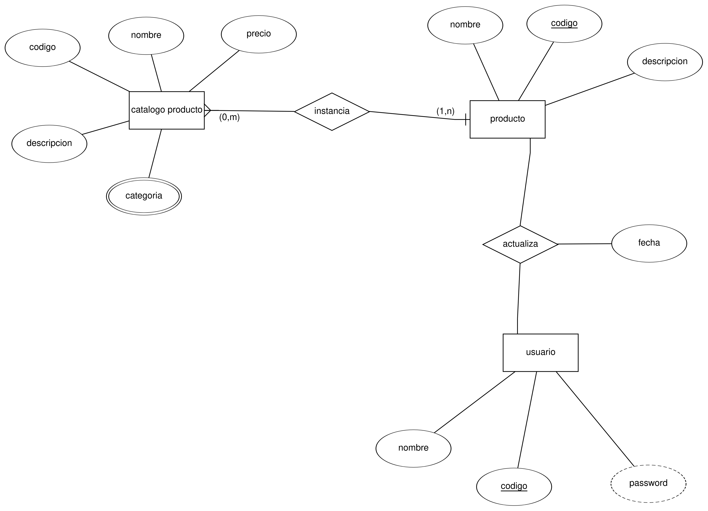

# Caso

para la siguente prueba de concepto se esta considerando un escenario donde un usuario, con privilegios
de administrador pueda consultar un catalogo de productos,buscar, agregar, eliminar y actualizar datos de
los items.

Para el modelo de datos se considera la siguiente semantica:

* Catalogo producto: son los productos genericos existentes, con caracteristicas
generales que los puedan diferenciar:

    >ejemplo: televisor samsung de 25 pulgadas con precio $23 es diferente a
    televisor samsung de 25 pulgadas con precio $26

    >ejemplo2: un boleto de vuelo pagado con millas es diferente a uno pagado
    con dinero.

* Producto: son las instancias de los productos, los `items`, si el catalago es
televisor samsung, el producto es televisor con codigo `NNNNNNNN` color negro

# Consideraciones

* **Para la demo solo se esta considerando que el usuario pueda realizar operaciones de
manipulacion de datos (DML) sobre las tablas de modificacion y productos.**

* se creo el atributo id en el modelo logico el cual sera una autoincremental que no tenga
relacion semantica con los demas campos de la relacion (tabla), ya que su funcion es solo
establecer un una relacion entre tablas, cosa que si en un futuro el campo codigo es modificado
la integridad de los datos no se vera afectada

* se estan validaciones sencillas, como no mostrar errores del tipo:

    >Este producto no existe
    >Id invalido

asi no se muestra informacion de mas un posible atacante

# Siguientes pasos

1. Dado el modelo logico de datos, es posible agregar un atributo de `cantidad` a la relacion
2. Se podran asignar permisos de modificacion a los usuarios segregandolos por alguna categoria
y cruzando la informacion con la tabla categorias. (Autenticacion)
3. En temas de seguridad, sanitizar el ingreso de datos (usar regex no deterministico para evitar DDOS)
4. Dado que se almacena una credencial del usuario seria buena idea implementar un cifrado, como el aplicativo
sera web se podria usar un middleware con jwt.
